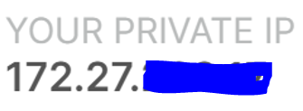
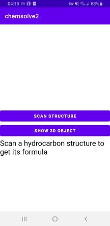
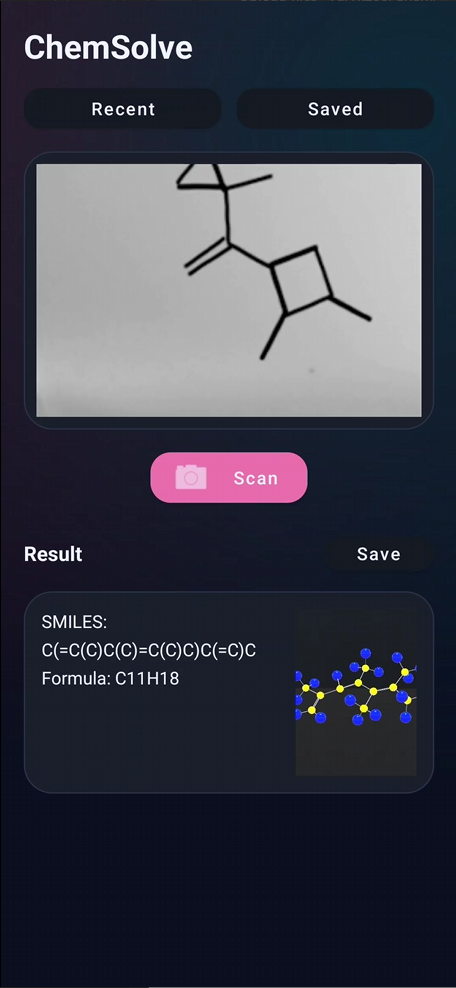
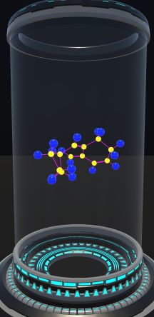
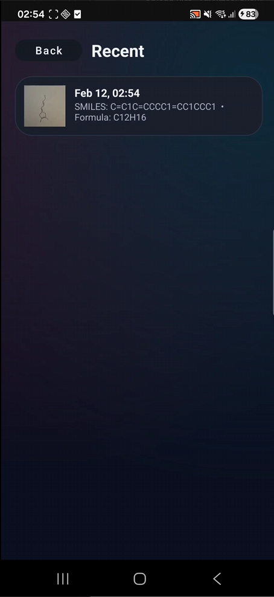
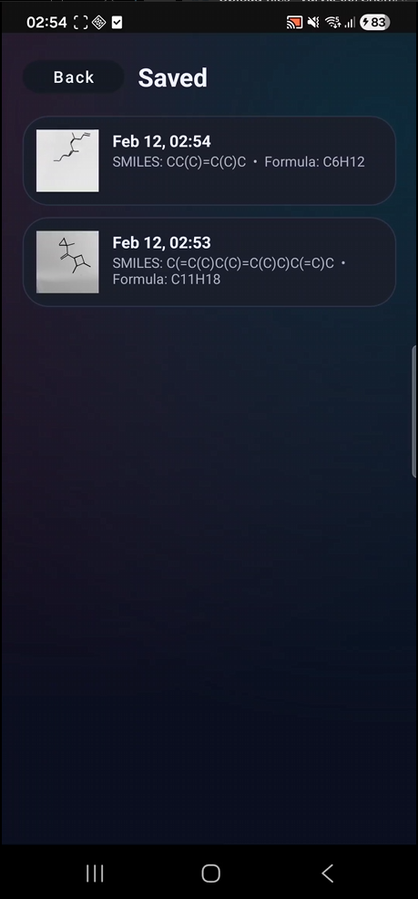

# ⌬ ChemSolve - Final Year Project

ChemSolve is an Android mobile application that converts images of hydrocarbon structures into chemical representations and interactive 3D molecular models. The system combines computer vision, machine learning inference and real-time 3D rendering through a client-server architecture.

The goal of the project is to demonstrate an end-to-end pipeline from image acquisition to chemical interpretation and visualization on mobile devices.

## 📋 Overview

How it works - Pipeline:
1. User captures or selects an image of a hydrocarbon structure
2. Image is sent to a Flask backend via multipart POST request
3. Backend performs inference and structure reconstruction
4. Backend returns JSON containing:
   * SMILES string
   * Molecular formula
   * SDF representation
5. Android app:
   * Displays textual results
   * Saves scan to local database
   * Loads SDF into Unity for real-time 3D rendering
  
The application demonstrates integration between mobile development, machine learning inference and 3D visualization.

## 📖 TOC
- [📋 Overview](#overview)
- [System Architecture](#system-architecture)
- [📚 Technical Stack](#-technical-stack)
- [🎬 DEMO](#demo)
- [🤖 Machine Learning Model | im2smiles](#machine-learning-model--im2smiles)
- [🖧 Network Connections](#network-connections)
- [⚙️ Unity Instance](#unity-instance)
- [🔥 Updates](#updates)

## System Architecture

### 📱 Mobile Client (Android | Java)

* Java-based Android application
* Image capture via camera or gallery
* REST-based client–server communication using OkHttp
* Local persistence using Room database
* Integrated Unity engine for in-app real-time 3D molecular rendering

### 🧠 Backend Server (Python)

* Flask REST API for image ingestion
* Image-to-structure inference pipeline
* Image → SMILES conversion
* Generation of SDF files for 3D reconstruction
* Stateless request handling for scalability

### 🧪 3D Visualization (Unity | C#)

* Runtime parsing of SDF molecular data
* Dynamic generation of atoms and bonds
* Real-time rendering embedded inside Android activity
* Automatic teardown and reload of molecular scenes between scans

## 📚 Technical Stack

#### Mobile
* Android (Java)
* Room Database
* OkHttp
* Unity (embedded)

#### Backend
* Python
* Flask
* RDKit
* REST API

#### Visualization
* Unity 2021 LTS
* OpenGL ES 3.0
* Custom SDF parser (C#)

## 🎬 DEMO

### Features demonstrated:

* Image scan → chemical interpretation
* Live SMILES and formula generation
* In-app 3D molecular visualization
* Persistent scan history


## 🤖 Machine Learning Model | im2smiles

The CNN ML model used in this project was sourced from [ChemPixCH](https://github.com/mtzgroup/ChemPixCH?tab=readme-ov-file) by mtzgroup "Hand Drawn Hydrocarbon Recognition. The Github repo shows installation, how to build the datasets and training the neural network.

While this model was the basis for the model used in this project, the files do vary between eachother as the model made by the mtzgroup is built using TensorFlow 1.1.0. I had to update the model to use TensorFlow 2.10.1, this was done for multiple reasons which are explained here [Report](https://github.com/yuryk200/ChemApp-Final-Year-Project/blob/main/c19489214-FinalReport.pdf).

The main way to update the files to TensorFlow 2.10.1 was using this line:
```Bash
tf_upgrade_v2 - infile foo.py - output foo-upgraded.py
```
Since the code was updated the Python enviroment had to be updated too, this Python env uses CUDA 11 which is important to be able to train the model on on RTX 3080 GPU and will have to be changed if trained on different GPUs.

To make the conda env:
```Bash
conda env create -f PythonEnviroment.yaml
```
To activate the env:
```Bash
conda activate tfv2
```
## 🖧 Network Connections
Currently with how the pipeline is set-up the mobile application only works over the local network.

You first run the flask server with:
```Bash
python server.py
```
This starts the server and you should get a output like this:


Use the very last address that appears for you, in my case "192.169.1.6:5000" and plug it into this line in MainActivity.java in the chemsolve/app folder: 


Then in android studio you need to rebuild the project for the changes to take effect.

There are methods I used to connect the mobile application over any network that being OpenVPN and Ngrok.

With OpenVPN you want to make an account and download the app on your phone and device you are running the server from. Then activate the VPN and plug in the address it provides you into the MainActivity.java line shown above. 

This is what the address looks like:



## ⚙️ Unity Instance

ChemSolve includes a Unity-based molecular visualisation system used for
interactive molecule rendering and rotation.

The Unity launcher in the chemsolve mobile app might not contain the scripts used for the 3D creation logic, this is because the Unity Launcher is a exported android-compatible build used for android applications, but the full scripts and scene set up can be found in the full Unity project repo.

This Unity project contains the 3D rendering logic, molecule generation and interaction scripts used by the Android application.

👉 The full Unity project, technical documentation and implementation details
can be found [here](https://github.com/yuryk200/Unity-3D-SDF).

### Features
- Procedural molecule generation
- Interactive rotation and scaling
- Mobile-optimised rendering
- Designed for integration with the ChemSolve Android app

## 🔥 Updates

### Latest Changes

* Added dedicated Recent and Saved pages
* UI Imporvements
* Automatic 3D model refresh on new scan
* Loading overlay added during backend processing
* Removed overlapping molecule instances
* Improved Android–Unity synchronization
* Added gallery image selection in addition to camera capture

#### UI Improvements
Gave the UI a fresh coat of paint and implemented quality of life improvements.

##### Before Scan

| | | 
| :------------------------------------------------------------------------------: | :---------------------------------------------------------------: |
|                                     Old UI (v1.0)                                |                    New UI (v2.0)                                  | 

##### After Scan

| ||
| :------------------------------------------------------------------------------: | :---------------------------------------------------------------: |
|                                     Old UI (v1.0)                                |                    New UI (v2.0)                                  |

##### New Unity Instance
Instead of you having to press the "Show 3D Object" and it taking you to a seperate Unity instance to show the chemical structure, it wow whenever you scan, opens a small unity instance in the results box to show the 3D structure and updates with each scan

| ||
| :-------------------------------------------------------------------------------------------: | :---------------------------------------------------------------: |
|                                     Old UI (v1.0)                                             |                    New UI (v2.0)                                  |

#### Dedicated Recent and Saved pages
Added a recent page to store recent scans and made a saved page to store saved scans, each stored scan can then be viewed again on main app page.

| ||
| :--------------------------------------------------------------: | :------------------------------------------------------------: |
|                                     Recent Page                  |                    Saved Page                                  |
