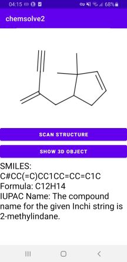
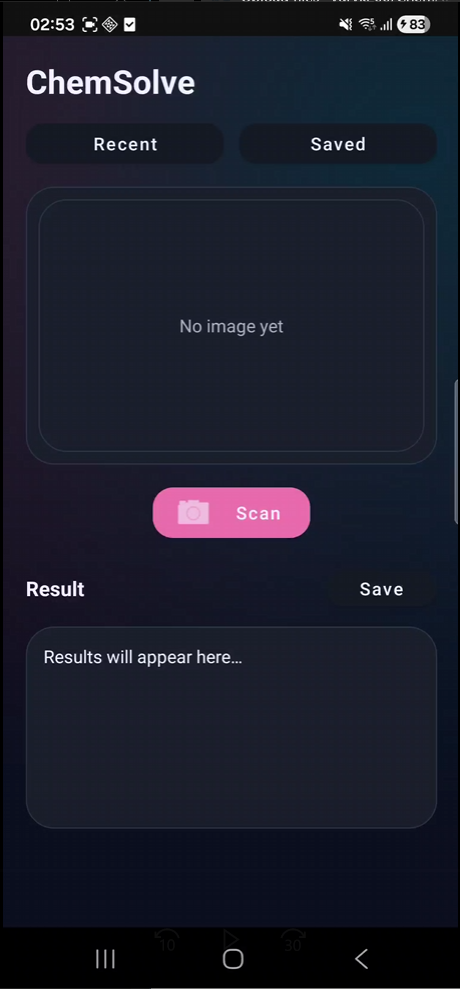

<h1>ChemSolve - Final Year Project</h1>

ChemSolve is an Android mobile application that converts images of hydrocarbon structures into chemical representations and interactive 3D molecular models. The system combines computer vision, machine learning inference and real-time 3D rendering through a client-server architecture.

The goal of the project is to demonstrate an end-to-end pipeline from image acquisition to chemical interpretation and visualization on mobile devices.

<h3>Updates</h3>
<h4>UI Improvements</h4>

Gave the UI a fresh coat of paint and implemented quality of life improvements.

<table>
  <tr>
    <td align="center">
       
      <b>Old UI (v1.0)</b>
    </td>

    <td align="center">
       
      <b>New UI (v2.0)</b>
    </td>
  </tr>
</table>

 Welcome to Chemsolve, in this repo you can download the android app chemsolve and the machine learning model im2smilesv2.

The App take pictures of Hydrocarbons you want to classify, the hydrocarbon is then sent to the server running the ML model which will send back the information about the hydrocarbon back to the app.

Once the information is retrieved you can get the app to display a 3D rendering of the hydrocarbon you sent to be scanned, process shown in images below.

#Note

For this to work you need to be running the server.py script in the folder im2smilesv2, I usually run this in Visual Studio. For the server to run and be fully functional you need to set on the python environment to the file in FYPFinal PythonEnviroment.yaml, otherwise the ML model won’t work.

Also you need an OpenVPN account on your phone and computer and have them both active when using app and server and also in the android app it is important to change the url IP to the IP of the OpenVPN running on the laptop/computer as this can change everytime you turn on OpenVPN, process for this shown below.

Use this IP in OpenVPN

In this URL in the chemsolve app

